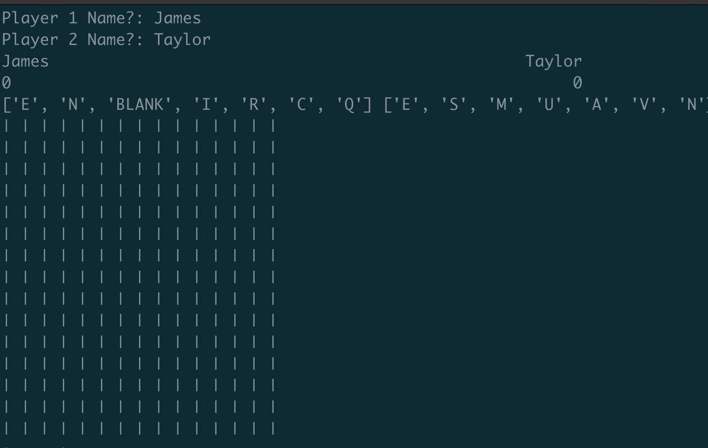

# words

## Description

My girlfriend and I play WordsWithFriends a lot. I absolutely hate the ads, and am considering leaving here because of them.

My proposed solution is that I create a version of WordsWithFriends that does not have the ads (or I die alone).

## Some Pics:

## Does This Work?

Kind of. 

## What needs to be implemented to finish this:

 - modifiers for the squares. Each Tile object is correctly calculated, but I haven't implemented Double Word Score / Double Letter Score modifiers yet.

