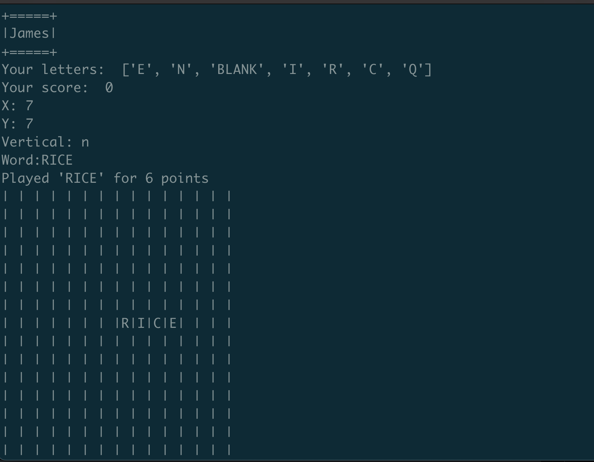
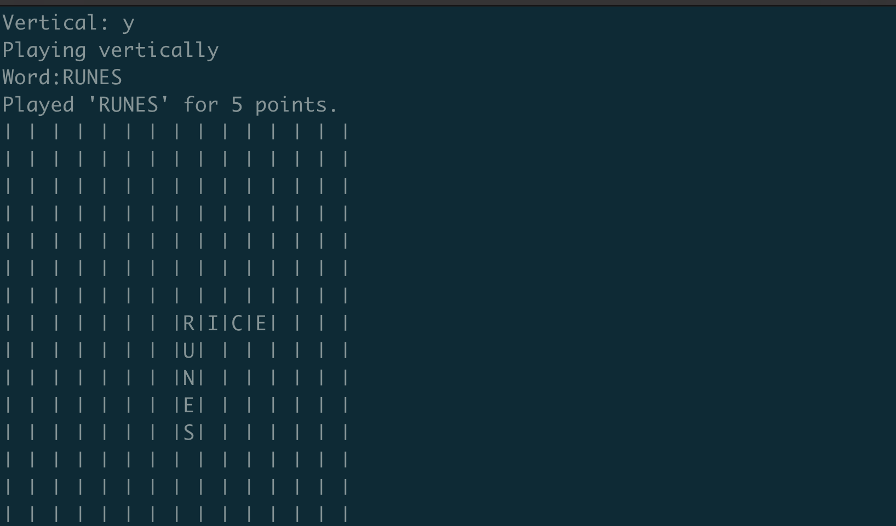

# words

## Description

This repository contains a **WordsWithFriends** knockoff. 

This project has two componentes: the **game server**, written in Python/Flask, and the **game client**, written in Javascript/ReactJS.

A further testing client exists that provides a TUI to play the game as well.

### Installation:

- You must run `setup-dictionaries.sh` once in order to unpack the dictionaries that the game uses.
- `./words.py`

### Testing Client

## Known Issues:

___11-28-2023:___
- The `[BLANK]` tile needs to be properly implemented.
- Words that start on a previously-played tile at position x, y suffer from a bug where the current character at X, Y is not counted against the player's hand. This is a breaking issue.
